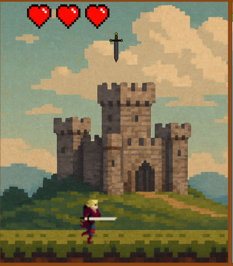

# 🎮 Multi Purpose

**Multi Purpose**, aynı anda birden fazla karakteri kontrol ettiğiniz, zihin ve refleksleri zorlayan bir 2D HTML5 oyunudur. Oyun, ekranın bölünmüş alanlarında eş zamanlı olarak 5 farklı mini oyunu oynayarak hayatta kalmaya çalıştığınız yaratıcı bir konsept sunar.

## 🕹️ Oyun Hakkında

- Oyun, **HTML Canvas** üzerinde **JavaScript** ile geliştirilmiştir.
- Ekran, her biri farklı bir mini oyun içeren 5 parçaya ayrılmıştır.
- Her mini oyunun kendi kuralları ve dinamikleri vardır.
- Her mini oyunda 3 canınız bulunur. Herhangi birinde canınız sıfırlanırsa oyunu kaybedersiniz.

## 🎯 Oynanış Mekanikleri

Her ekran farklı bir oyun türünü temsil eder:

-  **Kaçınma Bölgeleri:** Üzerinize gelen hedeflerden kaçarak hayatta kalmalısınız.


---

-  **Saldırı Bölgesi:** Cadının asasını kullanarak üzerinize gelen hedefleri yere düşmeden önce yok etmelisiniz.


---
-  **Kırma Bölgeleri:** Karşınıza çıkan kalkanları kırarak onların size hasar vurmasını önlemelisiniz.
  
Tüm bu görevleri aynı anda yaparken, diğer ekranlardaki karakterlerinizi de kontrol etmeli ve hasar almamalarını sağlamalısınız.


---


## ⚙️ Teknolojiler

- HTML5 (Canvas)
- JavaScript

- AI destekli araçlar ve bazı YouTube içerikleri ile desteklenmiştir

## 📦 Oyunu Çalıştırma

1. Bu linki URL ye yapıştırarak oyuna ulaşabilirsiniz.
   ```bash
   https://ahmettcimen.github.io/MultiPurposeGame/

