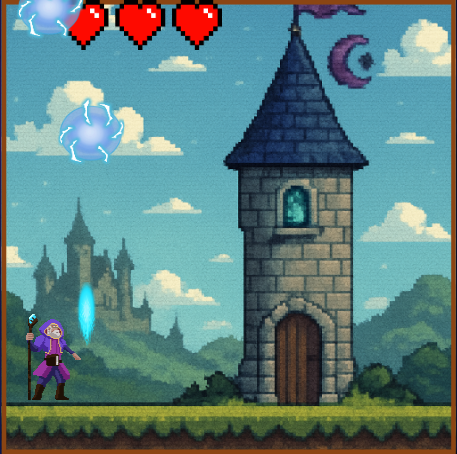
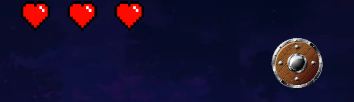

# 🎮 Multi Purpose

**Multi Purpose**, aynı anda birden fazla karakteri kontrol ettiğiniz, zihin ve refleksleri zorlayan bir 2D HTML5 oyunudur. Oyun, ekranın bölünmüş alanlarında eş zamanlı olarak 5 farklı mini oyunu oynayarak hayatta kalmaya çalıştığınız yaratıcı bir konsept sunar.

## 🕹️ Oyun Hakkında

- Oyun, **HTML Canvas** üzerinde **JavaScript** ile geliştirilmiştir.
- Ekran, her biri farklı bir mini oyun içeren 5 parçaya ayrılmıştır.
- Her mini oyunun kendi kuralları ve dinamikleri vardır.
- Her mini oyunda 3 canınız bulunur. Herhangi birinde canınız sıfırlanırsa oyunu kaybedersiniz.

## 🎯 Oynanış Mekanikleri

Her ekran farklı bir oyun türünü temsil eder:

- **Kaçınma Bölgeleri:** Üzerinize gelen hedeflerden kaçarak hayatta kalmalısınız.
  

---

- **Saldırı Bölgesi:** Cadının asasını kullanarak üzerinize gelen hedefleri yere düşmeden önce yok etmelisiniz.
  

---

- **Kırma Bölgeleri:** Karşınıza çıkan kalkanları kırarak onların size hasar vurmasını önlemelisiniz.

Tüm bu görevleri aynı anda yaparken, diğer ekranlardaki karakterlerinizi de kontrol etmeli ve hasar almamalarını sağlamalısınız.


---

## ❓ Nasıl Oynanır

Her bölgede farklı kontrollerle hayatta kalmalısın. Tüm bölgelerde eş zamanlı dikkatli ol!

---

### 🔹 1. Sol Üst Bölge – Kaçış (Yukarıdan Gelen Nesneler)

- ⌨️ **Tuşlar:** `A` ve `D`
- ⚠️ Yukarıdan gelen nesnelerden **kaç**!

---

### 🔹 2. Orta Sol Bölge – Kaçış (Aşağıdan Gelen Nesneler)

- ⌨️ **Tuşlar:** `A` ve `D`
- ⚠️ Aşağıdan gelen nesnelerden **kaç**!

---

### 🔹 3. Sol Alt Bölge – Zıplama ile Kaçış

- ⌨️ **Tuş:** `W`
- 🪂 Düşmanlardan **zıplayarak kaç**!

---

### 🔹 4. Sağ İç Bölge – Ateş Et

- ⌨️ **Tuş:** `Space (Boşluk)`
- 🎯 Düşmanlara ateş ederek **vur**!

---

### 🔹 5. Sağ Bölge – Kalkan Kırma

- 🖱️ **Fare Tıklaması**
- 🛡️ Beliren kalkanlara **tıkla ve kır**.
- ⏳ 15 saniye içinde kırmazsan hasar alırsın!

---

### 🚨 Uyarı!

- ❤️ Her bölgede **3 canın** var.
- ☠️ Herhangi bir bölgede canın biterse **oyunu kaybedersin**.

## ⚙️ Teknolojiler

- HTML5 (Canvas)
- JavaScript

- AI destekli araçlar ve bazı YouTube içerikleri ile desteklenmiştir

## 📦 Oyunu Çalıştırma

1. Bu linki URL ye yapıştırarak oyuna ulaşabilirsiniz.
   ```bash
   https://ahmettcimen.github.io/MultiPurposeGame/


   ```
 ## 🎨 Kullanılan Assetler ve Kaynaklar

Bu projede çeşitli açık kaynak ve ticari olmayan varlıklar kullanılmıştır. Tüm varlıklar eğitim ve demo amaçlıdır. Aşağıda kullanılan assetlerin listesi bulunmaktadır:

---

### 👾 Karakter ve Animasyon Paketleri

- 🧙‍♂️ **Wizard Pack** – [Luiz Melo (itch.io)](https://luizmelo.itch.io/wizard-pack)  
- 🛡️ **Medieval Fantasy Character Pack** – [Oco (itch.io)](https://oco.itch.io/medieval-fantasy-character-pack)  
- ⚔️ **Warrior Free Animation Set** – [Clembod (itch.io)](https://clembod.itch.io/warrior-free-animation-set?download#google_vignette)

---

### ❤️ Oyun İçi Objeler

- ❤️ **Can (Heart) Sembolü** – Minecraft'tan alınmıştır.  
- 🔥 **Ateş Topu (Fireball)** – Minecraft görsel öğesi kullanılmıştır.

---

### 🎵 Müzik ve Ses Efektleri

- 🎶 **"Rhodok Town"** – *Mount & Blade* Soundtrack  
- 🎶 **"Vaegir Lord's Hall"** – *Mount & Blade: Warband* OST  
- 🔊 **Ses Efektleri** – [uppbeat.io](https://uppbeat.io)

---

### 🖼️ Arka Planlar

- Bazı arka planlar, görsel üretim sürecinde **ChatGPT** üzerinden AI destekli olarak oluşturulmuştur.

---

> 📌 Tüm içerikler yalnızca **kişisel, eğitimsel ve deneysel** projelerde kullanım amacıyla alınmıştır. Orijinal sahiplerine aittir. Ticari amaçla kullanılması önerilmez.

